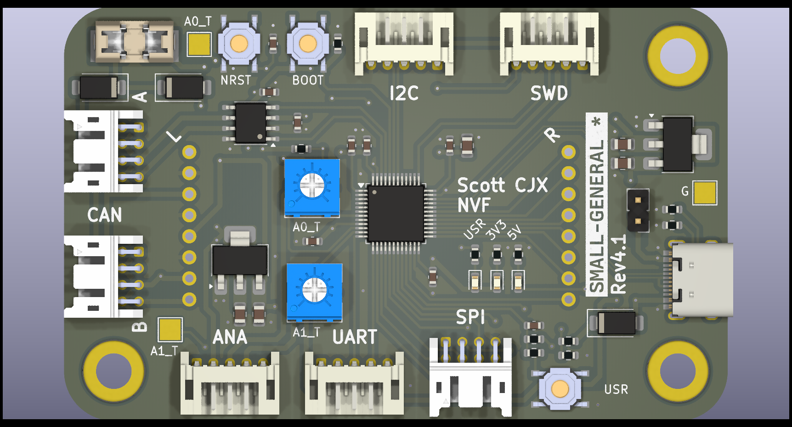
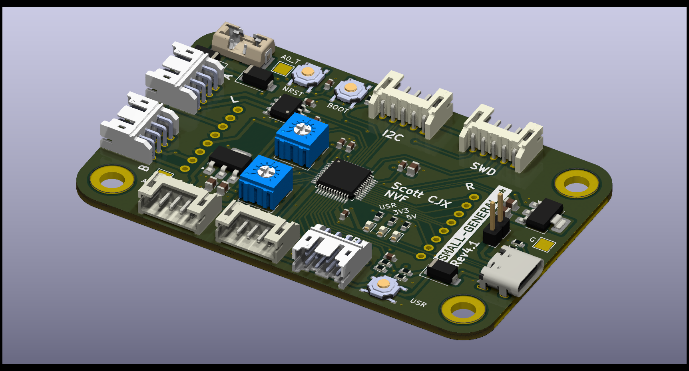
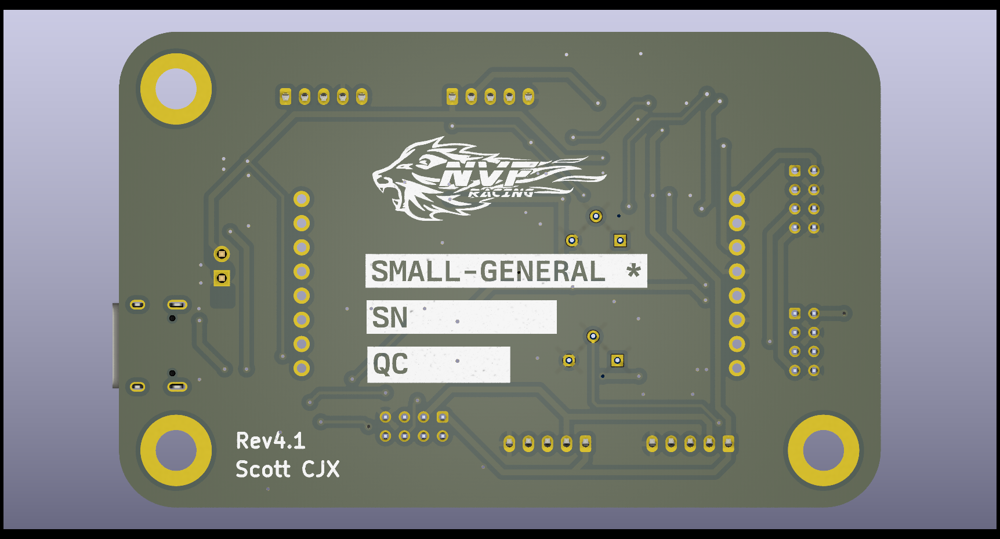

# Small General (Rev 4.1)

This repository contains all documents regarding the Small General board.

### Shortcuts
- [Schematics](#Schematics)
- [Assembly](#Assembly)
- [Renders](#Renders)
- [Bom](#Bom)

---

## Schematics

## Assembly

## Renders

## Bom

[Interactive BOM](./ibom/ibom)

[BOM](./bom/SmallGeneral-BOM.csv)

